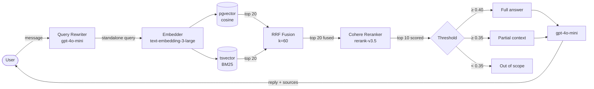
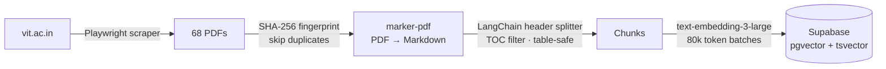

# NOVA — VIT University Q&A Chatbot

> RAG-powered conversational AI for answering VIT Vellore queries using official university documents.

**Stack:** Next.js 14 · FastAPI · PostgreSQL + pgvector · OpenAI · Cohere · Python

**Frontend repo:** [nova-frontend](https://github.com/AdityaMedidala/vit-qa-bot)

---

## Table of Contents

1. [Overview](#overview)
2. [Architecture](#architecture)
3. [Project Structure](#project-structure)
4. [Retrieval Pipeline](#retrieval-pipeline)
5. [Ingestion Pipeline](#ingestion-pipeline)
6. [Setup](#setup)
7. [API Reference](#api-reference)
8. [Database Schema](#database-schema)

---

## Overview

NOVA answers student queries about VIT Vellore by retrieving answers from 68 official university documents — academic regulations, hostel policies, fee structures, programme brochures, NIRF reports, and more.

**Key capabilities:**
- Hybrid BM25 + vector search with RRF fusion
- Cohere cross-encoder reranking
- Multi-threshold scoring with source citations
- Follow-up question handling via query rewriting
- 3,800+ indexed chunks across 68 documents

---

## Architecture

**Query pipeline:**



**Ingestion pipeline:**



---

## Project Structure

```
nova/
├── app/                              # FastAPI backend
│   ├── __init__.py
│   ├── db.py                         # ThreadedConnectionPool (psycopg2)
│   ├── main.py                       # /chat endpoint
│   ├── final_retreval.py             # Hybrid search + Cohere reranking
│   ├── retrieval_core.py             # Thresholds, context building, answer gen
│   └── query_rewrite.py              # Follow-up → standalone query
│
├── data-pipeline/
│   ├── __init__.py
│   ├── ingestion/
│   │   ├── __init__.py
│   │   ├── scan.py                   # PDF → Markdown via marker-pdf
│   │   ├── chunking.py               # Header splitting + TOC detection
│   │   ├── final_ingestion.py        # Embed + DB insert + fingerprinting
│   │   └── ingest_folder.py          # Sequential ingestion runner
│   ├── scraper/
│   │   └── scraper.py                # Playwright crawler for vit.ac.in
│   └── notebooks/
│       └── VITingestdownload.ipynb   # Colab ingestion notebook (T4 GPU)
│
├── data/                             # Place PDFs here before running ingestion
│   └── .gitkeep                      # Folder tracked in git, contents gitignored
├── requirements.txt                  # API server dependencies
├── requirements-ingestion.txt        # Colab ingestion dependencies
├── requirements-scraping.txt         # Scraper dependencies
├── .env.example                      # Copy to .env and fill in your keys
└── .env                              # gitignored
```

---

## Retrieval Pipeline

```
User message
    │
    ▼  (follow-up only)
Query Rewriter ── gpt-4o-mini rewrites to standalone question
    │
    ▼
Embed query ── text-embedding-3-large (3072d)
    │
    ├──────────────────────────────────────┐
    ▼                                      ▼
Vector Search                          BM25 Full-Text
pgvector cosine · top 20               tsvector plainto_tsquery · top 20
    │                                      │
    └─────────────────┬────────────────────┘
                      ▼
               RRF Fusion  k=60
               rank-based, scale-agnostic
                      │
                      ▼
            Cohere rerank-v3.5
            cross-encoder: query + chunk seen together
            top 10 · relevance scores 0–1
                      │
                      ▼
            Threshold Scoring
            score ≥ 0.40  →  full answer
            score ≥ 0.35  →  partial context
            score < 0.35  →  out of scope
                      │
                      ▼
            gpt-4o-mini generates answer + source citations
```

**Why RRF over score normalization?**
BM25 and cosine scores live on different scales. RRF uses only rank position so there's no scale mismatch to correct.

**Why cross-encoder reranking?**
The bi-encoder used for vector search encodes query and chunk separately — it misses token-level interaction between them. Cohere's cross-encoder sees both concatenated, giving significantly more accurate relevance scores at the cost of latency (acceptable since it only runs on top-20 candidates).

---

## Ingestion Pipeline

Run on Google Colab (T4 GPU) — see `data-pipeline/notebooks/VITingestdownload.ipynb`.

```
vit.ac.in
    │
    ▼
Playwright Crawler
JS-rendered pages · 120 pages crawled · 153 PDFs found
    │
    ▼
Download + Filter
68 high-signal PDFs · ~346 MB
filtered out: meeting minutes, sports achievements, blank forms, old calendars
    │
    ▼
SHA-256 Fingerprinting
skip already-ingested documents on re-runs
    │
    ▼
marker-pdf extraction
PDF → structured Markdown  (GPU-accelerated on T4)
    │
    ▼
Header-Aware Chunking
LangChain MarkdownHeaderTextSplitter  (#, ##, ###, ####)
TOC detection and removal
table-safe splitting — no mid-table cuts
recursive size management — max 1500 chars
    │
    ▼
OpenAI Embeddings
text-embedding-3-large · token-batched at 80k tokens/batch
    │
    ▼
PostgreSQL + pgvector
68 documents · 3,800+ chunks
```

> **Note on parallelism:** `ingest_folder.py` runs sequentially. `ProcessPoolExecutor` was attempted (3 workers) but PyTorch raises `RuntimeError: Cannot re-initialize CUDA in forked subprocess` on Linux because the default start method is `fork`. marker-pdf loads CUDA models at import time. Sequential is the correct approach — marker is GPU-bound anyway so parallelism wouldn't help throughput.

---

## Setup

### Prerequisites

- Python 3.11+
- PostgreSQL with pgvector (Supabase recommended)
- OpenAI API key
- Cohere API key

### 1. Clone and install

```bash
git clone https://github.com/your-username/nova-vit
cd nova-vit
pip install -r requirements.txt
```

### 2. Configure environment

```bash
cp .env.example .env
# Fill in your keys
```

```env
OPENAI_API_KEY=sk-...
COHERE_API_KEY=...
SUPABASE_URL=postgresql://postgres:[password]@[host]:5432/postgres
```

### 3. Add your PDFs

Place PDF files in the `data/` folder before running ingestion. The folder exists in the repo (tracked via `.gitkeep`) but its contents are gitignored — PDFs are not committed.

```bash
data/
├── Academic-Regulations.pdf
├── Student-Code-of-Conduct.pdf
└── ...
```

To scrape PDFs from vit.ac.in directly:

```bash
pip install -r requirements-scraping.txt
playwright install chromium
python data-pipeline/scraper/scraper.py
```

Or run the full ingestion notebook on Colab T4: `data-pipeline/notebooks/VITingestdownload.ipynb`

### 4. Set up the database

```sql
CREATE EXTENSION vector;

CREATE TABLE documents (
    document_id   UUID PRIMARY KEY DEFAULT gen_random_uuid(),
    document_name TEXT NOT NULL,
    fingerprint   TEXT UNIQUE NOT NULL,
    status        TEXT NOT NULL,
    error_message TEXT,
    created_at    TIMESTAMPTZ DEFAULT now(),
    updated_at    TIMESTAMPTZ DEFAULT now()
);

CREATE TABLE document_chunks (
    id            UUID PRIMARY KEY DEFAULT gen_random_uuid(),
    chunk_id      TEXT UNIQUE NOT NULL,
    document_id   UUID REFERENCES documents(document_id),
    document_text TEXT NOT NULL,
    text          TEXT NOT NULL,
    embedding     vector(3072) NOT NULL,
    metadata      JSONB NOT NULL,
    char_count    INTEGER NOT NULL,
    ts            TSVECTOR,
    created_at    TIMESTAMPTZ DEFAULT now()
);

-- Vector index
CREATE INDEX ON document_chunks USING hnsw (embedding vector_cosine_ops);

-- Full-text index
CREATE INDEX ON document_chunks USING GIN (ts);

-- Auto-populate tsvector on insert/update
CREATE TRIGGER tsvector_update
BEFORE INSERT OR UPDATE ON document_chunks
FOR EACH ROW EXECUTE FUNCTION
tsvector_update_trigger(ts, 'pg_catalog.english', text);
```

### 5. Run the server

```bash
python -m uvicorn app.main:app --reload
```

---

## API Reference

### `GET /`

```json
{ "status": "backend is running" }
```

### `POST /chat`

```json
// Request
{
  "message": "What is the attendance policy at VIT?",
  "conversation_id": "optional-uuid"
}

// Response
{
  "reply": "VIT requires a minimum of 75% attendance...",
  "conversation_id": "550e8400-e29b-41d4-a716-446655440000",
  "sources": [
    {
      "document": "Academic Regulations",
      "section": "Attendance Requirements",
      "chunk_id": "academic_regulations__attendance_requirements__chunk_002"
    }
  ]
}
```

Pass the returned `conversation_id` in subsequent messages to enable follow-up handling. The backend rewrites follow-ups into standalone queries before retrieval.

---

## Database Schema

| Table | Column | Type | Notes |
|---|---|---|---|
| `documents` | `document_id` | UUID | PK |
| | `fingerprint` | TEXT | SHA-256, unique — prevents re-ingestion |
| | `status` | TEXT | `processing` · `done` · `failed` |
| `document_chunks` | `chunk_id` | TEXT | Slug-based: `doc__section__chunk_000` |
| | `embedding` | vector(3072) | text-embedding-3-large |
| | `ts` | tsvector | auto-populated via trigger |
| | `metadata` | jsonb | `{document, level_1, char_count}` |

---

## Author

**Aditya** — B.Tech Information Technology, VIT Vellore 2026